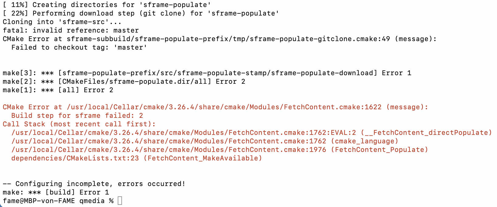

- [Workshop 1](#workshop-1)
  - [Findings](#findings)
  - [Meeting](#meeting)
- [Workshop 2](#workshop-2)
  - [Warp / MOQT](#warp--moqt)
    - [How they work:](#how-they-work)
      - [Notable](#notable)
      - [Warp Client](#warp-client)
      - [Warp Server](#warp-server)
      - [MoQT Client](#moqt-client)
      - [MoQt Server](#moqt-server)
  - [RUSH](#rush)
    - [Problems](#problems)
    - [How it works](#how-it-works)
      - [Client](#client)
        - [Encoder](#encoder)
        - [Player](#player)
      - [Server](#server)
  - [QUICR](#quicr)
    - [Problems](#problems-1)
    - [How it works](#how-it-works-1)
      - [Client](#client-1)
      - [Server](#server-1)
- [Workshop 3](#workshop-3)

---

# Workshop 1

## Findings

- WARP runs
  - had to remove WebTransport option to get it working (was getting TLS handshake error before)

- QUICR (at least the provided code) only works on macOS

- RUSH runs, but video player doesn't receive the video

## Meeting
TO DO: 
  - get demos running
  - how are they working?
  - benchmarking

---
---

# Workshop 2

## Warp / MOQT

Streaming a video using webtransport-go

### How they work:

#### Notable
  - uses WebTransport clientside
  - video is played on a ``<canvas>``
  - there are 4 bytes "warp" before every message
  - uses "tracks" for video and audio segments // TODO what are their significance?

#### Warp Client
  - create __Player__ class / needs url (H3 video endpoint), fingerprint (TLS cert stuff), canvas (video output element)
    - Player constructor creates 
      - __Video__ class and __Audio__ class (seems complicated, I assume this is stuff that MSE would do automatically when using a ``<video>`` Element, rather than using a ``<canvas>``)
      - __Transport__ class
        - establishes __WebTransport__ to server
        - creates a unidirectional stream for all messages from client to server
        - starts listening for incoming Unidirectional streams (video segments)
        - on received stream, reads it and processes the data (init, tracks, video, audio, etc.)
    - in the background there is lots of stuff happening with streams, video and audio
  - player.play() starts video

#### Warp Server
Go: modified version of quic-go/webtransport-go by quic-go
  - creates the Media
    - as far as I can tell, this reads the mpd file and parses it into an Object
  - reads TLS cert and key
  - creates WARP config
    - address: ":port" the address the server is listening on
    - cert files: TLS stuff
    - log directory: writes logs to this directory
    - media: see above
  - creates WARP server using above WARP config and runs it
    - server listens to endpoint "/watch" for video streaming
    - on WebTransport connection on "/watch" endpoint, server starts sending the video, each segment on its own Unidirectional Stream (overly simplified, hard to read the code since they seem to implement the whole H3 spec)

#### MoQT Client
  - create __Transport__ class first, takes url and fingerprint
    - same as WARP
  - create __Player__ class, takes transport and canvas
    - seems to have completely redone the Video/Audio/Canvas stuff 
    - rest seems to be mostly the same
  - player.play() starts video

#### MoQt Server
Rust: Quiche by Cloudflare
  - creates __Server__ class and runs it
    - that is about as much I can understand in Rust, looks very complicated
     (I can't even find where the "/watch" endpoint is defined 🫣)
    - I assume, though that it essentially does the same just in Rust and maybe optimized for better performance

---

## RUSH

Demo is a implementation of a streamer streaming video to viewers using webtransport-go.

### Problems
  - no video on receiver

### How it works

#### Client

There are two client pages
  - /src-encoder : this is the streamer, who record their webcam and sends the feed to the server
  - /src-player : watches the stream, receives the video feed from the server
  
##### Encoder
  - latency "realtime", sends one frame at a time
  - runs audio / video recorder / encoder and sender in dedicated WebWorkers
    - sender creates a WebTransport connection and sends the data

##### Player
  - runs audio / video decoder and downloader in dedicated WebWorkers
  - plays video on a ``<canvas>`` element

#### Server
  - acts as a relay between streamer (encoder) and viewer (player)
  - uses webtransport-go
  - listens on two endpoints:
    - ``"/moqingest"`` for receiving the stream from the streamer (encoder) 
      - receives one frame per stream
      - saves frame to a file
    - ``"/moqdelivery"`` for sending the stream to the viewer (player)
      - reads frame from file
      - sends frame to client

---

## QUICR

Implementation of a video call program using [libquicr](https://github.com/Quicr/libquicr) (API implementation) based on [quicrq](https://github.com/Quicr/quicrq) (library). Allows bidirectional communication or one publisher with multiple subscribers.

### Problems
-  needs MacOS, make all fails:

### How it works

#### Client
  - runs in a dedicated macOS program, not in a browser
  - 

#### Server

---
---

# Workshop 3